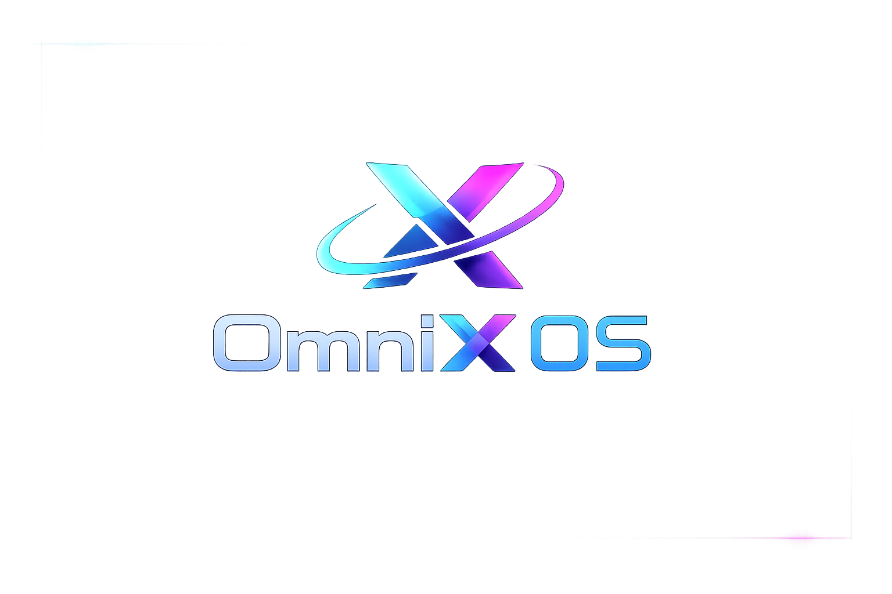
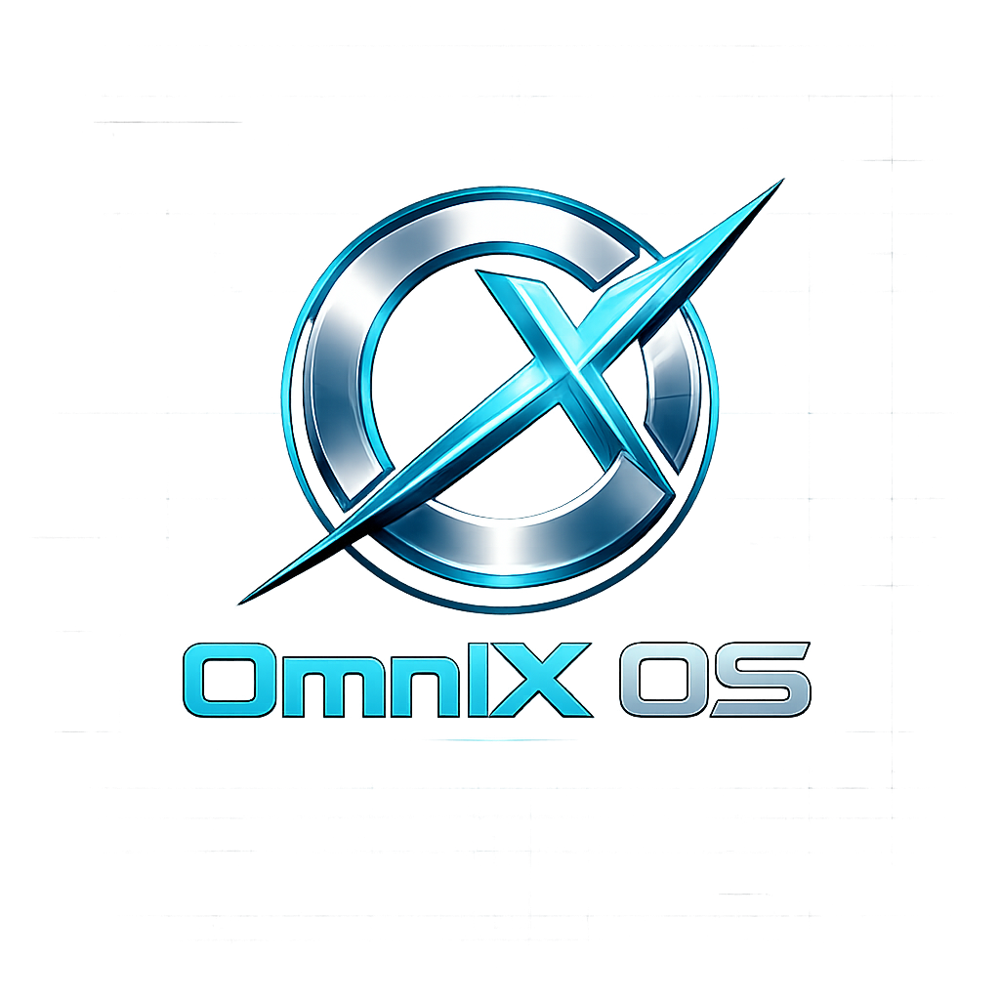

# OmniX OS

  
  &nbsp;&nbsp;&nbsp;&nbsp;
  

**OmniX OS** je vlastní, nezávislý operační systém (bare-metal) vyvíjený od nuly v jazyce Assembly (NASM). 

> **⚠️ Důležité:** Tento systém **NENÍ postavený na MS-DOSu ani Linuxu!** Nejedná se o žádnou modifikaci existujícího systému, ale o kompletně vlastní architekturu od nejnižší úrovně hardwaru.

## 🚀 Architektura a Funkce

Projekt v současné době využívá pokročilou **dvojfázovou (Two-Stage) architekturu**:

*   **Stage 1 (Bootloader):** Vlastní zavaděč (`boot.asm`), který se vejde do prvních 512 bajtů (Boot Sektor) a jehož úkolem je bezpečně načíst jádro do paměti RAM a předat mu řízení.
*   **Stage 2 (Kernel):** Vlastní jádro (`kernel.asm`) běžící na paměťové adrese `0x8000`. Poskytuje neomezený prostor pro rozšiřování kódu.
*   **Vlastní Shell:** Interaktivní příkazový řádek s podporou zadávání textu, mazání (Backspace) a zpracováním příkazů.
*   **Automatický CI/CD Build:** Celý OS se automaticky sestavuje pomocí GitHub Actions do čistého obrazu diskety (`omnix_os.img`).

## 🛠️ Jak spustit OmniX OS

1. Stáhni si zkompilovaný obraz disku `omnix_os.img` (generuje se automaticky při každé úpravě kódu).
2. Otevři libovolný x86 emulátor:
   * **Na Androidu:** Doporučujeme *Limbo PC Emulator*.
   * **Na PC:** QEMU, VirtualBox, nebo VMware.
3. Vlož soubor `omnix_os.img` do virtuální **disketové mechaniky (Floppy Drive)**.
4. Spusť virtuální stroj a systém okamžitě nabootuje!

## 💿 OmniX OS 

Vlastní operační systém napsaný v Rustu a Asembly na holém železe!

## 🎨 Zdroje a Grafika
Ve složce [`res/`](res/) najdeš oficiální artworky a grafiku pro OmniX OS, včetně hlavní (fialové) a alternativní (stříbrné) verze loga, které vidíš nahoře.
